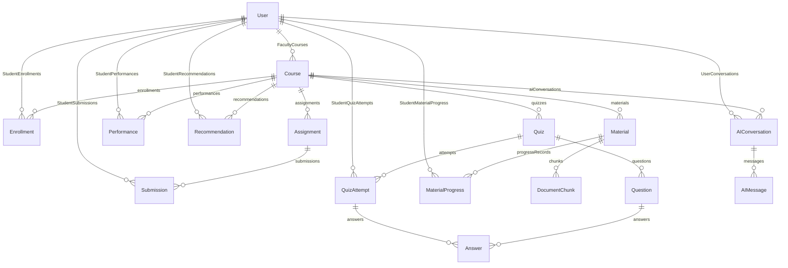

# System Architecture

This document describes the end-to-end software architecture, data modeling, security enforcement, and subsystem interactions of **AURA LMS**.

---

## 1. High-Level Architecture Overview

```
┌────────────────────────────────────────────────────────────────────────────┐
│                       NEXT.JS 16 APP ROUTER (PORT 3000)                    │
│                                                                            │
│  ┌───────────────────────┐  ┌───────────────────────┐  ┌────────────────┐ │
│  │    Student Portal     │  │    Faculty Portal     │  │ Admin Console  │ │
│  │ (Dashboard, AI Tutor, │  │ (Course & Material Mgt│  │ (User Roster,  │ │
│  │  Materials, Quizzes)  │  │  Grading, Analytics)  │  │  Audit Logs)   │ │
│  └───────────┬───────────┘  └───────────┬───────────┘  └───────┬────────┘ │
│              │                          │                      │          │
│              └──────────────────────────┴──────────────────────┘          │
│                                         │                                  │
│                          AuthContext + apiRequest()                        │
└─────────────────────────────────────────┼──────────────────────────────────┘
                                          │ HTTP REST + Bearer JWT
                                          ▼
┌────────────────────────────────────────────────────────────────────────────┐
│                        EXPRESS 5 BACKEND (PORT 5000)                       │
│                                                                            │
│  ┌──────────────────────────────────────────────────────────────────────┐  │
│  │                          Middleware Pipeline                         │  │
│  │   CORS ──▶ Express.json() ──▶ JWT Authenticate ──▶ Role Authorize    │  │
│  │   ──▶ IDOR Student Isolation ──▶ Centralized Error Handler           │  │
│  └──────────────────────────────────┬───────────────────────────────────┘  │
│                                     │                                      │
│  ┌──────────────────────────────────┴───────────────────────────────────┐  │
│  │                           Controllers Layer                          │  │
│  │   auth  •  course  •  material  •  ai  •  quiz  •  assignment        │  │
│  │   academic  •  analytics  •  user  •  profile                        │  │
│  └──────────────────────────────────┬───────────────────────────────────┘  │
│                                     │                                      │
│  ┌──────────────────────────────────┴───────────────────────────────────┐  │
│  │                            Services Layer                            │  │
│  │  ┌─────────────────┐ ┌────────────────────┐ ┌──────────────────────┐ │  │
│  │  │   RAGService    │ │ StudentContextSvc  │ │ MaterialService      │ │  │
│  │  │ (Query + Cosine)│ │ (Zero-PII Profile) │ │ (PDF Text Ingestion) │ │  │
│  │  └────────┬────────┘ └─────────┬──────────┘ └──────────┬───────────┘ │  │
│  │           │                    │                       │             │  │
│  │  ┌────────┴────────────────────┴───────────────────────┴───────────┐ │  │
│  │  │              Decoupled LLM Provider (GeminiProvider)            │ │  │
│  │  │         @google/genai (gemini-3.7-flash + gemini-embedding-001) │ │  │
│  │  └─────────────────────────────────────────────────────────────────┘ │  │
│  └──────────────────────────────────┬───────────────────────────────────┘  │
│                                     │                                      │
│                                Prisma ORM                                  │
└─────────────────────────────────────┼──────────────────────────────────────┘
                                      │ PostgreSQL Pool + pgvector
                                      ▼
┌────────────────────────────────────────────────────────────────────────────┐
│                    POSTGRESQL 18.6 WITH PGVECTOR 0.8.6                     │
│                                                                            │
│  • User (Role: STUDENT, FACULTY, ADMIN)   • DocumentChunk (vector(3072))   │
│  • Course, Enrollment, Material           • Quiz, Question, QuizAttempt    │
│  • Assignment, Submission                 • AIConversation, AIMessage      │
│  • MaterialProgress, Performance          • Recommendation                 │
└────────────────────────────────────────────────────────────────────────────┘
```

---

## 2. Frontend Architecture (Next.js 16 App Router)

### Client vs Server Separation
- **App Router Directory**: `frontend/app`
- **Root Shell**: [`frontend/app/layout.tsx`](file:///c:/Users/DELL/Desktop/FINAL%20YEAR/ai-powered-lms/frontend/app/layout.tsx) wraps the entire application in `AuthProvider` and applies global styles.
- **Client Components (`"use client"`)**: Used across all interactive views, modals, forms, and chat boxes to maintain real-time state, localStorage sync, and dynamic event handling.

### Portal Hierarchy & Role Isolation
1. **Public Routes**:
   - `/`: Academic landing page featuring institutional hero, platform stats, core architecture showcase, and direct role-based sign-in links.
   - `/(auth)/login`: Institutional login supporting role redirection.
   - `/(auth)/register`: Public registration for `STUDENT` and `FACULTY`.
2. **Student Portal (`/student/*`)**:
   - Shared Layout: [`frontend/app/student/layout.tsx`](file:///c:/Users/DELL/Desktop/FINAL%20YEAR/ai-powered-lms/frontend/app/student/layout.tsx) with `DashboardShell`, student navigation sidebar, and topbar.
   - Pages: Dashboard, Courses, Course Detail, Materials, AI Tutor, Quizzes, Quiz Taking, Assignments, Performance Analytics, Recommendations, Profile.
3. **Faculty Portal (`/faculty/*`)**:
   - Shared Layout: [`frontend/app/faculty/layout.tsx`](file:///c:/Users/DELL/Desktop/FINAL%20YEAR/ai-powered-lms/frontend/app/faculty/layout.tsx).
   - Pages: Dashboard, Course Management, Course Creator, Course Detail, Material Uploads, Quiz Creator, Assignment Grading, Cohort Analytics, Student Directory, Profile.
4. **Administrator Console (`/admin/*`)**:
   - Shared Layout: [`frontend/app/admin/layout.tsx`](file:///c:/Users/DELL/Desktop/FINAL%20YEAR/ai-powered-lms/frontend/app/admin/layout.tsx).
   - Pages: System Dashboard, University User Directory, Course Directory, Faculty Roster, Student Roster.

### Component System
- **Shell & Navigation**: [`DashboardShell.tsx`](file:///c:/Users/DELL/Desktop/FINAL%20YEAR/ai-powered-lms/frontend/components/layout/DashboardShell.tsx), [`Sidebar.tsx`](file:///c:/Users/DELL/Desktop/FINAL%20YEAR/ai-powered-lms/frontend/components/layout/Sidebar.tsx), [`Topbar.tsx`](file:///c:/Users/DELL/Desktop/FINAL%20YEAR/ai-powered-lms/frontend/components/layout/Topbar.tsx).
- **Core Widgets**:
  - [`AIChatBox.tsx`](file:///c:/Users/DELL/Desktop/FINAL%20YEAR/ai-powered-lms/frontend/components/tutor/AIChatBox.tsx): Course-grounded RAG chat box with thread switching, real-time citation badges, and suggestions.
  - [`PDFViewerModal.tsx`](file:///c:/Users/DELL/Desktop/FINAL%20YEAR/ai-powered-lms/frontend/components/materials/PDFViewerModal.tsx): Canvas-based dynamic PDF viewer with progress tracking and resume prompt.
  - [`QuizGeneratorModal.tsx`](file:///c:/Users/DELL/Desktop/FINAL%20YEAR/ai-powered-lms/frontend/components/quiz/QuizGeneratorModal.tsx): Modal for drafting syllabus-aligned diagnostic quizzes.
  - UI Primitives: `Badge.tsx`, `CourseCard.tsx`, `EmptyState.tsx`, `ProgressBar.tsx`, `SkeletonLoader.tsx`, `StatCard.tsx`.

---

## 3. Backend Architecture (Express Layered Pattern)

The Express backend strictly enforces a four-tier architecture:

1. **Routes Tier (`backend/src/routes/`)**:
   - Defines HTTP verb mappings, URL route parameters, and attaches authentication (`authenticate`), role authorization (`authorizeRoles`), and IDOR checks (`authorizeStudentAccess`).
2. **Controllers Tier (`backend/src/controllers/`)**:
   - Handles incoming HTTP requests, extracts parameters/body, executes basic parameter validation, delegates to services, and shapes standard JSON responses.
3. **Services Tier (`backend/src/services/`)**:
   - Encapsulates all academic business logic, AI pipelines, vector computations, and database transactions.
4. **Data Access Tier (`backend/src/lib/prisma.ts`)**:
   - Interacts with PostgreSQL using Prisma ORM client with pgvector raw SQL queries.

---

## 4. PostgreSQL & Prisma Data Modeling

The Prisma schema defines 16 interconnected models:



### Relational Schema Summary:
- **`User`**: Core identity table (`id`, `name`, `email`, `role`, `department`, `enrollmentNo`, `employeeId`, `passwordHash`, `avatarUrl`).
- **`Course`**: Academic courses (`id`, `code`, `title`, `description`, `department`, `semester`, `credits`, `facultyId`).
- **`Enrollment`**: Student-to-Course many-to-many relationship with `progressPercentage` and `status`.
- **`Material`**: Course documents (`title`, `unit`, `fileUrl`, `fileSize`, `processingStatus`, `ragChunksCount`).
- **`DocumentChunk`**: Ingested text segments with `vector(3072)` embeddings, page numbers, and token counts.
- **`Assignment` & `Submission`**: Course coursework with total points, student submission text/file, score, and faculty feedback.
- **`Quiz`, `Question`, `QuizAttempt`, `Answer`**: Comprehensive assessment engine tracking correct options, Bloom's level, student selections, percentage scores, and automatically tagged `weakTopicsIdentified`.
- **`AIConversation` & `AIMessage`**: Chat threads and messages storing verified sources and follow-up prompts.
- **`MaterialProgress`**: Per-student reading state (`currentPage`, `totalPages`, `progressPercent`, `completed`).
- **`Performance` & `Recommendation`**: Aggregated performance metrics and personalized remediation items.

---

## 5. Authentication, RBAC & Security Architecture

### Authentication Flow
1. **Password Hashing**: User passwords are encrypted using `bcrypt.hash(password, 10)`.
2. **Token Generation**: On successful login (`POST /api/auth/login`), a signed JWT is issued with:
   - `userId`: User UUID
   - `email`: Institutional email
   - `role`: `STUDENT`, `FACULTY`, or `ADMIN`
   - `department`: Academic department
   - Lifetime: 7 days (`7d`)
3. **Session Verification**: `GET /api/auth/me` decodes the token and returns the full sanitized user profile.

### Role-Based Access Control (RBAC)
- **Middleware**: `authorizeRoles(...allowedRoles: Role[])` in [`role.middleware.ts`](file:///c:/Users/DELL/Desktop/FINAL%20YEAR/ai-powered-lms/backend/src/middleware/role.middleware.ts).
- **Public Restriction**: Registration for `ADMIN` role is blocked at the public API endpoint (`POST /api/auth/register` returns `400 Bad Request`).
- **Course Material & Quiz Management**: Restricted to `FACULTY` and `ADMIN`.
- **Enrollment & Quiz Submission**: Restricted to `STUDENT`.
- **User Directory**: Restricted strictly to `ADMIN`.

### IDOR Ownership Isolation Matrix
- **Middleware**: `authorizeStudentAccess(paramName = "id")`:
  - If user is `STUDENT`, verifies `req.user.userId === req.params[paramName]`. Cross-student requests are rejected with `403 Forbidden`.
  - If user is `FACULTY` or `ADMIN`, permits access for legitimate departmental supervision.
  - Applies to: `/api/students/:id/*`, `/api/analytics/student/:id`.

---

## 6. AI Academic Tutor & Vector RAG Pipeline

```
Student Query ("How does Raft elect a leader?")
                     │
                     ▼
  1. Generate 3072-dim query embedding via gemini-embedding-001
                     │
                     ▼
  2. SQL Cosine Distance Search on PostgreSQL (<=>)
     SELECT ... FROM "DocumentChunk" dc JOIN "Material" m ...
     WHERE m."courseId" = $targetCourse AND dc.embedding IS NOT NULL
     ORDER BY (dc.embedding <=> queryVector) ASC LIMIT 5;
                     │
                     ▼
  3. Filter chunks by similarity threshold (similarity >= 0.55)
                     │
                     ▼
  4. Fetch Sanitized Student Profile (Zero-PII)
     - Weak topics from past quiz attempts (e.g., "Raft Consensus")
     - Enrolled progress and active recommendations
                     │
                     ▼
  5. Assemble Grounded Prompt with Strict Directives
     - Answer ONLY from course context
     - Out-of-syllabus rejection directive ("I couldn't find enough material...")
     - Adaptive pedagogical guidance targeting student's weak areas
     - Previous 5 messages for conversational continuity
                     │
                     ▼
  6. Execute LLM Completion via gemini-3.7-flash (temperature: 0.2)
     - Standard chat: thinkingBudget = 0 (low latency)
     - Mathematical proof / derivation: thinkingBudget = 1024
                     │
                     ▼
  7. Persist AIMessage in PostgreSQL with Sources & Suggested Follow-Ups
```

### Privacy & Guardrail Principles
- **Zero-PII Prompt Injection**: `student-context.service.ts` excludes names, emails, roll numbers, and IDs when building prompt context.
- **Anti-Hallucination Guardrail**: Queries unrelated to the uploaded course notes trigger explicit out-of-syllabus responses without fabricating citations.
- **Course Isolation**: Vector queries strictly enforce `WHERE m."courseId" = $2`.

---

## 7. Learning Analytics & At-Risk Diagnostic Engine

### Weak Topics Identification
- When a student completes a quiz (`POST /api/quizzes/:id/attempts`), incorrect answers are mapped to their respective question topics and persisted into `QuizAttempt.weakTopicsIdentified`.
- Aggregated across attempts by `getStudentWeakTopics()`:
  - If a topic is failed $>1$ time: Flagged as `CRITICAL` severity.
  - If failed 1 time: Flagged as `MODERATE` severity.

### At-Risk Student Classification (`GET /api/analytics/at-risk`)
- Evaluates student progress against quiz mastery:
  - **`HIGH` Risk**: Course progress $< 40\%$ AND Average quiz score $< 60\%$.
    - Intervention: *"Assign 1-on-1 peer tutor and schedule lab reinforcement session."*
  - **`MEDIUM` Risk**: Course progress $< 50\%$ OR Average quiz score $< 65\%$.
    - Intervention: *"Provide curated RAG-generated lecture review notes and diagnostic quiz."*
